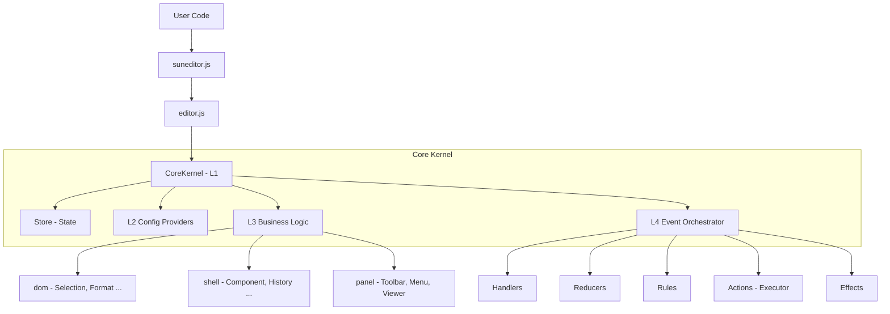

# SunEditor Architecture

> **Note**: This document describes SunEditor internals in detail.
> For usage guides and API references, please see [GUIDE.md](./GUIDE.md).

---

## 1. Design Philosophy

SunEditor is architected to be a WYSIWYG editor with constraints:

- **Zero Dependencies**: No frameworks (React/Vue/Angular) or libraries (jQuery/Lodash) in the core.
- **Vanilla JavaScript**: Written in modern ES2022+, utilizing native browser APIs.
- **State-aware editing**: Uses internal state management in addition to native `contentEditable` behavior.

## 2. High-Level Architecture

The system follows a layered architecture with a central Dependency Injection (DI) container.



### Detailed Structure

```
┌─────────────────────────────────────────────────────────────────┐
│                        suneditor.js                             │
│                    (Factory Entry Point)                        │
│  • create(target, options) → new Editor()                       │
│  • init(options) → { create() }                                 │
└────────────────────────────┬────────────────────────────────────┘
                             │ creates
                             ▼
┌─────────────────────────────────────────────────────────────────┐
│                         editor.js                               │
│                  (Main Editor Class - Facade)                   │
│                                                                 │
│  Public: isEmpty, resetOptions, changeFrameContext, destroy     │
│  Internal: Plugin lifecycle, multi-root, frame init             │
│                                                                 │
│  ┌───────────────────────────────────────────────────────────┐  │
│  │                    CoreKernel (L1)                        │  │
│  │          Dependency Container & Orchestrator              │  │
│  │                                                           │  │
│  │  ┌──────────┐  ┌────────────────────────────────────┐     │  │
│  │  │  Store   │  │  $ (Deps bag)                      │     │  │
│  │  │ #state   │  │  All dependencies in one object    │     │  │
│  │  │ mode     │  │  Shared with all consumers         │     │  │
│  │  └──────────┘  └────────────────────────────────────┘     │  │
│  │                                                           │  │
│  │  L2: Config ───────────────────────────────────────────┐  │  │
│  │  │ contextProvider  │ optionProvider                   │  │  │
│  │  │ instanceCheck    │ eventManager                     │  │  │
│  │  └─────────────────────────────────────────────────────┘  │  │
│  │                                                           │  │
│  │  L3: Logic ────────────────────────────────────────────┐  │  │
│  │  │ dom/: selection, format, inline, html               │  │  │
│  │  │       listFormat, nodeTransform, char, offset       │  │  │
│  │  │ shell/: component, focusManager, pluginManager      │  │  │
│  │  │         ui, commandDispatcher, history, shortcuts   │  │  │
│  │  │ panel/: toolbar, subToolbar*, menu, viewer          │  │  │
│  │  └─────────────────────────────────────────────────────┘  │  │
│  │                                                           │  │
│  │  L4: Event ────────────────────────────────────────────┐  │  │
│  │  │ EventOrchestrator                                   │  │  │
│  │  │ (handlers → reducers → rules → executor → effects)  │  │  │
│  │  └─────────────────────────────────────────────────────┘  │  │
│  └───────────────────────────────────────────────────────────┘  │
└─────────────────────────────────────────────────────────────────┘
```

### The Entry Point (Factory Pattern)

- **`suneditor.js`**: The public entry point. It validates initialization options and target elements before creating the editor instance.
- **`editor.js`**: The Facade. It orchestrates initialization, plugin lifecycle, and multi-root management. Exposes minimal public methods (`isEmpty`, `resetOptions`, `changeFrameContext`, `destroy`) and the `$` (Deps) object for full API access.

---

## 3. CoreKernel & Dependency Injection

The central runtime container is **CoreKernel** (`src/core/kernel/coreKernel.js`).

### The `$` (Deps) Object

Instead of passing dozens of arguments between modules, the Kernel builds a single dependency bag called **`$`**. This object is shared by reference across the entire system.

**Full `$` Object Structure:**

```
$ = {
    // L1: Core
    facade,              // Editor instance (public API)
    store,               // Store instance

    // L2: Config (Phase 1 - available to L3 constructors)
    contextProvider,     // Context/FrameContext management
    optionProvider,      // Options/FrameOptions management
    instanceCheck,       // Iframe-safe type checks
    eventManager,        // Public event API

    // L2: Convenience accessors
    frameRoots,          // Map<rootKey, FrameContext>
    context,             // Global context (toolbar, statusbar, etc.)
    options,             // Base options Map
    icons,               // Icon set
    lang,                // Language strings
    frameContext,         // Current frame context (pointer)
    frameOptions,         // Current frame options (pointer)

    // L3: Logic (Phase 2 - added after all L3 instances created)
    // dom/
    offset, selection, format, inline,
    listFormat, html, nodeTransform, char,
    // shell/
    component, focusManager, pluginManager, plugins,
    ui, commandDispatcher, history, shortcuts,
    // panel/
    toolbar, subToolbar, menu, viewer  // subToolbar: second Toolbar instance, only if _subMode is set
}
```

### The 2-Phase Injection Strategy

1.  **Phase 1 (Config)**: The Kernel initializes L2 providers (`contextProvider`, `optionProvider`). These are added to `$` immediately.
    - _Why?_ L3 Logic classes need these configs during their own construction.
2.  **Phase 2 (Logic)**: The Kernel initializes L3 Logic modules (`selection`, `history`, `toolbar`), then assigns them to `$`.
    - _Why?_ Events and circular dependencies are resolved by assigning these instances to `$` _after_ they are all created.
3.  **Init Pass**: After Phase 2, the Kernel runs `_init()` on each L3 instance that implements it.
    - _Why?_ Some Logic modules require references to other L3 modules (which only become available after Phase 2).
4.  **L4 (Event)**: Finally, `EventOrchestrator` is created, completing the initialization chain.

### Dependency Access Patterns

| Consumer                   | Constructor                           | Access Pattern                                          |
| -------------------------- | ------------------------------------- | ------------------------------------------------------- |
| **Plugin**                 | `constructor(kernel, pluginOptions?)` | `this.$` via KernelInjector                             |
| **Core Logic** (L3)        | `constructor(kernel)`                 | `#kernel`, `#$` (= kernel.$), `#store` (= kernel.store) |
| **Module**                 | `constructor(inst, $, ...)`           | `#$` (Deps passed directly)                             |
| **EventOrchestrator** (L4) | `constructor(kernel)`                 | `this.$` via KernelInjector                             |

**Example - Plugin:**

```javascript
import { PluginCommand } from '../../interfaces';

class Blockquote extends PluginCommand {
	static key = 'blockquote';

	constructor(editor) {
		super(editor); // KernelInjector → this.$ = kernel.$
		this.title = this.$.lang.tag_blockquote;
	}

	action() {
		const node = this.$.selection.getNode();
		this.$.format.applyBlock(this.quoteTag.cloneNode(false));
	}
}
```

**Example - Core Logic Class:**

```javascript
class Component {
	#kernel;
	#$;
	#store;

	constructor(kernel) {
		this.#kernel = kernel;
		this.#$ = kernel.$;
		this.#store = kernel.store;
		// Cache frequently used deps
		this.#options = this.#$.options;
		this.#frameContext = this.#$.frameContext;
		this.#eventManager = this.#$.eventManager;
	}
}
```

**Example - Module:**

```javascript
class Modal {
    #$;

    constructor(inst, $, element) {
        this.#$ = $;  // Deps passed directly, no inheritance
        this.inst = inst;
        this.#$.eventManager.addEvent(element, 'submit', ...);
    }
}
```

### Kernel Layers

| Layer          | Responsibility               | Components                                                                |
| :------------- | :--------------------------- | :------------------------------------------------------------------------ |
| **L1: Kernel** | Dependency Injection & State | `CoreKernel`, `Store`, `KernelInjector`                                   |
| **L2: Config** | Environment & Options        | `ContextProvider`, `OptionProvider`, `InstanceCheck`, `EventManager`      |
| **L3: Logic**  | Core editing logic           | `Selection`, `Format`, `History`, `PluginManager`, `Toolbar`, `Component` |
| **L4: Event**  | Input Orchestration          | `EventOrchestrator` (Redux-style event pipeline)                          |

---

## 4. State Management (The Store)

State is managed by **`Store`** (`src/core/kernel/store.js`). It distinguishes clearly between **Configuration** (read-only options) and **Runtime State** (mutable).

### State Keys

| Key                     | Type       | Default          | Description                    |
| ----------------------- | ---------- | ---------------- | ------------------------------ |
| `rootKey`               | `*`        | `product.rootId` | Current root frame key         |
| `hasFocus`              | `boolean`  | `false`          | Whether the editor has focus   |
| `tabSize`               | `number`   | `4`              | Tab character space count      |
| `indentSize`            | `number`   | `25`             | Block indent margin (px)       |
| `codeIndentSize`        | `number`   | `2`              | Code view indent space count   |
| `currentNodes`          | `string[]` | `[]`             | Selection path tag names       |
| `currentNodesMap`       | `string[]` | `[]`             | Active command/style names     |
| `initViewportHeight`    | `number`   | `0`              | Viewport height at init        |
| `currentViewportHeight` | `number`   | `0`              | Current visual viewport height |
| `controlActive`         | `boolean`  | `false`          | Controller/component active    |
| `isScrollable`          | `function` | `(fc) => ...`    | Frame content scrollability    |
| `_lastSelectionNode`    | `?Node`    | `null`           | Last selection node (cache)    |
| `_range`                | `?Range`   | `null`           | Cached selection range         |
| `_mousedown`            | `boolean`  | `false`          | Mouse button pressed           |
| `_preventBlur`          | `boolean`  | `false`          | Suppress blur handling         |
| `_preventFocus`         | `boolean`  | `false`          | Suppress focus handling        |

### Direct Properties (not in #state)

- `store.mode` - Immutable toolbar mode flags (`isClassic`, `isInline`, `isBalloon`, `isBalloonAlways`, `isSubBalloon`, `isSubBalloonAlways`)
- `store._editorInitFinished` - Editor initialization complete flag

### Subscription System

Components subscribe to state changes to update UI reactively without tight coupling.

```javascript
// Read
const rootKey = store.get('rootKey');
const hasFocus = store.get('hasFocus');

// Write (notifies subscribers)
store.set('hasFocus', true);
store.set('_preventBlur', false);

// Subscribe
const unsubscribe = store.subscribe('hasFocus', (newVal, oldVal) => { ... });
unsubscribe(); // cleanup
```

---

## 5. Type System

SunEditor uses JSDoc for type annotations and TypeScript for type checking (no TS source files, only generated `.d.ts`).

### Key Type Names

| JSDoc Type               | Meaning            | Used For                              |
| ------------------------ | ------------------ | ------------------------------------- |
| `SunEditor.Kernel`       | CoreKernel class   | Constructor `@param` in L3/L4 classes |
| `SunEditor.Deps`         | `$` dependency bag | `this.$` type, event callback params  |
| `SunEditor.Store`        | Store class        | `kernel.store`, `this.#store`         |
| `SunEditor.Instance`     | Editor class       | Public API facade                     |
| `SunEditor.Context`      | ContextMap         | Global context (toolbar, statusbar)   |
| `SunEditor.FrameContext` | FrameContextMap    | Per-frame context                     |
| `SunEditor.Options`      | BaseOptionsMap     | Shared options                        |
| `SunEditor.FrameOptions` | FrameOptionsMap    | Per-frame options                     |

**Rule:** `SunEditor.Kernel` is used ONLY for constructor parameter types. For everything else (event params, plugin `this.$`, module deps), use `SunEditor.Deps`.

---

## 6. Content Model

SunEditor uses explicit content rules to reduce inconsistent `contentEditable` output.

### Fundamental Units

Editor operations classify nodes using these categories: **Line**, **Block**, **Component**, and **Inline Component**.

#### 1. Line (Format Line)

- **Definition**: Basic text container elements that hold inline content and text
- **Purpose**: Contains inline content, text, and inline formatting (bold, italic, etc.)
- **Validation**: `format.isLine(element)` - checks against `formatLine` regex
- **Default Tags**: `P`, `H[1-6]`, `LI`, `TH`, `TD`, `DETAILS`, `PRE`
- **Subtypes**:
    - **Normal Line** (`format.isNormalLine()`): Standard text containers - `P`, `DIV`, `H1-H6`, `LI`, `DETAILS`
        - Line breaks: Use Enter key to create new line elements
        - Example: `<p>Line 1</p><p>Line 2</p>`
    - **BR Line** (`format.isBrLine()`): Line breaks use `<BR>` tags - `PRE`
        - Line breaks: Enter creates `<BR>` within same element
        - Example: `<pre>Line 1<br>Line 2</pre>`
    - **Closure BR Line** (`format.isClosureBrLine()`): BR lines that cannot be exited with Enter/Backspace
        - Used for special constrained editing contexts (e.g., table cells with BR mode)

#### 2. Block (Format Block)

- **Definition**: Structural container elements that wrap lines
- **Purpose**: Provides structural hierarchy around editable content
- **Validation**: `format.isBlock(element)` - checks against `formatBlock` regex
- **Default Tags**: `BLOCKQUOTE`, `OL`, `UL`, `FIGCAPTION`, `TABLE`, `THEAD`, `TBODY`, `TR`, `CAPTION`, `DETAILS`
- **Relationship**: Blocks structurally contain lines (e.g., `<blockquote><p>quoted text</p></blockquote>`)
- **Subtypes**:
    - **Normal Block** (`format.isBlock()` but not closure): Standard structural containers
        - Can be exited: Pressing Enter/Backspace at edges exits the block
    - **Closure Block** (`format.isClosureBlock()`): Constrained blocks that trap cursor
        - Tags: `TH`, `TD` (table cells)
        - Cannot be exited: Enter/Backspace always stays within the block

**Special Case: Lists (OL/UL/LI)**

Lists are a special Block-Line combination where:

- **List Container** (`OL`, `UL`): Block-level elements
- **List Item** (`LI`): Line-level elements that can ONLY exist inside list containers
- **Dedicated Class**: `listFormat.js` handles list-specific operations (nesting, indentation, merging)
- **Common Checks**: `dom.check.isList()`, `dom.check.isListCell()`

#### 3. Component

- **Definition**: Self-contained interactive elements (images, videos, tables, embedded content)
- **Purpose**: Rich media and special features - **same level as line** (not contained in line)
- **Validation**: `component.is(element)` - checks for component plugins
- **Container**: Component plugins typically use `se-component` or `se-flex-component` at the top level
    - **Images, Videos**: `<div class="se-component"><figure></figure></div>`
    - **Tables**: `<figure class="se-flex-component"><table>...</table></figure>`
    - **Audio, File uploads**: `<div class="se-component se-flex-component"><figure><audio|a></figure></div>`
- **Examples**: Images, videos, audio, tables, drawings

#### 3.1. Inline Component (Special Case)

- **Definition**: Components that exist **inside** lines (exception to the component-line sibling rule)
- **Validation**: `component.isInline(element)` - checks for `se-inline-component` class
- **Container**: Uses `<span class="se-component se-inline-component">` wrapper
- **Examples**: Math formulas, inline anchors

### Key Design Rules

1. **Category checks**: Core logic uses `format.isLine/isBlock/isClosureBlock` and `component.is/isInline` during editing operations
2. **Hierarchy**: `block` → contains → `line` (structural containment)
3. **Siblings**: **Block components** and `line` exist at the same hierarchy level
4. **Inline Exception**: **Inline components** can exist inside a `line`
5. **Block Wrapping**: Blocks provide structure by wrapping multiple lines

### Example Structure

```html
<div class="se-wrapper-wysiwyg">
	<p>
		Line 1: text with <span class="se-component se-inline-component"><katex>E=mc^2</katex></span> formula
	</p>
	<blockquote>
		<p>Line 2: quoted text</p>
	</blockquote>
	<div class="se-component">
		<figure></figure>
	</div>
	<ul>
		<li>Line 3: list item</li>
		<li>Line 4: list item</li>
	</ul>
</div>
```

### Content Filtering: strictMode

The `strictMode` option controls how strictly SunEditor validates and cleans HTML content.

**Configuration:**

```javascript
SUNEDITOR.create('#editor', {
	// Enable all filters (default)
	strictMode: true,

	// Granular control
	strictMode: {
		tagFilter: true,
		formatFilter: true,
		classFilter: true,
		textStyleTagFilter: true,
		attrFilter: true,
		styleFilter: true,
	},
});
```

| Filter                   | Purpose                                         | When Disabled                    |
| ------------------------ | ----------------------------------------------- | -------------------------------- |
| **`tagFilter`**          | Removes disallowed HTML tags                    | Allows any tags (security risk)  |
| **`formatFilter`**       | Enforces line/block/component structure         | Components may not wrap properly |
| **`classFilter`**        | Validates CSS classes                           | Allows any CSS classes           |
| **`textStyleTagFilter`** | Converts `<B>`, `<I>`, `<U>` to styled `<SPAN>` | Keeps original tags              |
| **`attrFilter`**         | Filters attributes                              | Allows any attributes (XSS risk) |
| **`styleFilter`**        | Filters inline styles                           | Allows any inline styles         |

---

## 7. Multi-Root Architecture

SunEditor uses a unified frame architecture for both single and multi-root editing.

### Data Storage Structure

```
editor
├── $.frameRoots (Map<rootKey, FrameContext>)  ← Actual data storage
│   ├── null → FrameContext              [Single-root: rootKey is null]
│   ├── rootKey1 → FrameContext1         [Multi-root]
│   └── rootKey2 → FrameContext2
│
├── $.context (ContextMap)               ← Global shared UI
├── $.frameContext (FrameContextMap)      ← Current frame pointer
├── $.frameOptions (FrameOptionsMap)     ← Current frame options pointer
└── $.options (BaseOptionsMap)           ← Shared config
```

### Key Concepts

1. **Unified Structure**: Single-root (`store.get('rootKey') === null`) and multi-root use the same architecture
2. **frameRoots Map**: Actual storage of all frame contexts
3. **Global Context** (`$.context`): Shared UI elements (toolbar, statusbar, modal overlay)
4. **Current Frame References**: `$.frameContext` and `$.frameOptions` are pointers, updated by `changeFrameContext(rootKey)`
5. **Frame switching**: `editor.changeFrameContext(rootKey)` updates `store.rootKey` and resets pointers

---

## 8. Plugin Architecture

Plugins follow the same integration pattern as core consumers. They extend **`KernelInjector`**, giving them direct access to the core `$` object.

```javascript
class MyPlugin extends PluginCommand {
	constructor(kernel) {
		super(kernel); // Injects this.$ automatically
	}

	action() {
		// Access core logic directly
		const selection = this.$.selection.get();
		this.$.history.push();
	}
}
```

Because plugins extend `KernelInjector`, they can access the same shared `$` dependency bag as core modules.

---

## 9. Event System

### EventManager vs EventOrchestrator

The event system is split into two distinct classes:

|              | EventManager (L2)                                                                | EventOrchestrator (L4)                                                      |
| ------------ | -------------------------------------------------------------------------------- | --------------------------------------------------------------------------- |
| **Location** | `config/eventManager.js`                                                         | `event/eventOrchestrator.js`                                                |
| **Role**     | Public event registration API                                                    | Internal DOM event processing                                               |
| **Methods**  | `addEvent`, `removeEvent`, `addGlobalEvent`, `removeGlobalEvent`, `triggerEvent` | `_addCommonEvents`, `_addFrameEvents`, `applyTagEffect`, `_callPluginEvent` |
| **Used by**  | Plugins, modules, core logic                                                     | CoreKernel only (internal)                                                  |
| **Extends**  | None                                                                             | KernelInjector                                                              |

**EventManager** is available as `this.$.eventManager` throughout the system. **EventOrchestrator** is created by CoreKernel and manages the internal event pipeline.

### Event Pipeline (Internal)

To handle the complexity of cross-browser `contentEditable` events, SunEditor uses a **Redux-like** pipeline:

```
DOM Event → Handler → Reducer → Rules → Action[] → Executor → Effects → DOM Update
```

| Component    | Location            | Purpose                                                                     |
| :----------- | :------------------ | :-------------------------------------------------------------------------- |
| **Handlers** | `event/handlers/`   | Capture raw DOM events (key, mouse, input, clipboard, dragDrop)             |
| **Reducers** | `event/reducers/`   | Analyze event + state → produce action list                                 |
| **Rules**    | `event/rules/`      | Granular key behavior rules (enter, backspace, delete, arrow, tab)          |
| **Actions**  | `event/actions/`    | Action type definitions (`{ t: string, p?: * }`)                            |
| **Executor** | `event/executor.js` | Dispatches action list through effect registries                            |
| **Effects**  | `event/effects/`    | Side-effect handlers (`common.registry`, `keydown.registry`, `ruleHelpers`) |

### Data Flow

```
1. Wysiwyg User Action (typing, paste, etc.):
   User Action → EventOrchestrator → Handler → Reducer → Rules → Action[]
                                                                    ↓
                                                              Executor → Effects → Logic Classes
                                                                                        ↓
                                                                                  [Plugin action]
                                                                                        ↓
                                                                                   DOM Update
                                                                                        ↓
                                                                                 History Push
                                                                                        ↓
                                                                            Trigger onChange Event
```

This separation keeps event handling predictable and easier to maintain across browsers.
